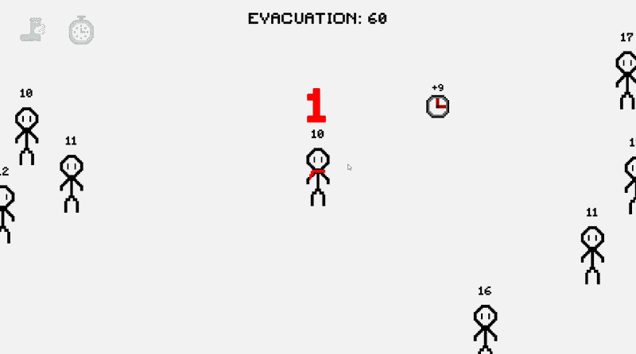

# ⏱️ Second Hand

**Second Hand** is a fast-paced 2D survival game built in **Unity and C#** during a **4-day game jam** with the theme **“Count Down.”**

Every character has a countdown timer that acts as their health. Avoid NPCs that can steal your seconds, swap timers to recover from dangerous situations, and compete for pickups while waiting for the evacuation exit to open.

**[🎮 Play Second Hand in your browser](https://alexziou.itch.io/second-hand)**

---

  

---

## 🎮 Gameplay

Your personal timer continuously decreases. If it reaches zero, you lose.

To survive, you need to balance movement, positioning and the game’s main mechanic: **exchanging your remaining time with an NPC**.

| Character | Before swapping | After swapping |
|---|---:|---:|
| Player | 6 seconds | 13 seconds |
| NPC | 13 seconds | 6 seconds |

Swapping can save you, but it can also create a new threat: the NPC receiving your lower timer may begin chasing you to steal time back.

Survive the **60-second evacuation countdown**, then reach the open exit before your personal timer expires. Opening the exit does not automatically win the game.

### Controls

| Input | Action |
|---|---|
| **WASD** | Move |
| **Mouse** | Hover over an NPC to select it |
| **Left click** | Swap timers with an eligible highlighted NPC |

## 🤖 NPC Behaviour

NPCs compete with the player and each other for time.

Their behaviour includes:

- **Wandering** when no suitable target is available.
- **Chasing** characters with more displayed time.
- **Fleeing** nearby characters with less displayed time.
- **Collecting watches** to replenish their timers.
- **Collecting abilities** for temporary advantages.
- **Steering away from arena boundaries.**

During physical contact, eligible NPCs can steal up to **one second per successful transfer**, subject to a stealing cooldown. The victim loses the same amount the NPC gains.

Because timers change through countdowns, stealing, swaps and pickups, the relationship between two characters can change during a match.

## 🎁 Pickups

Both the player and NPCs can collect pickups.

| Pickup | Effect |
|---|---|
| **Time Watch** | Immediately adds its displayed time value. Its value decreases while it remains on the floor. Watches cannot raise the collector’s timer above **30 seconds**. |
| **Hermes Boot** | Increases movement speed by **50% for 4 seconds**. |
| **Time Lock** | Prevents NPCs from stealing the collector’s time for **4 seconds**. A protected NPC cannot be targeted for a timer swap. |

**Time Lock does not stop the personal countdown.** The player can still swap with other eligible NPCs.

For Hermes Boot and Time Lock, the timer above the pickup shows how long it remains on the floor. The full effect duration starts when it is collected.

## 🛠️ Technical Implementation

### Shared character systems

The player and NPCs reuse components for timers, status effects, timer displays and animation.

`TimeHolder` manages countdowns and time changes. An expiry event lets separate systems respond appropriately: NPCs are removed, while player expiry triggers the defeat sequence.

### State-based NPC AI

`NPCMovement` uses five states: **Wander, Chase, CollectPickup, CollectAbility and Flee**.

NPCs reassess nearby targets at regular intervals. Watches and potential victims compete through a score based on available time and distance, while nearby threats take priority.

### Timer swapping

Mouse-based targeting is combined with range checks, cooldown tracking and Time Lock restrictions. The exchange itself is handled by the shared timer component.

### Spawning and population management

NPC replacements maintain activity as characters expire. Starting timers are randomized to spread out deaths.

Separate spawners control watches and abilities, with spawn intervals and active-pickup limits used for balancing. NPC and watch placement also check for collider clearance.

### Round flow and transitions

`GameManager` coordinates the starting countdown, evacuation timer, exit activation and victory or defeat.

A reusable pixel transition system uses **coroutines and callbacks** to switch scenes or panels while the screen is covered. Real-time waits allow transitions to continue while gameplay is paused.

## 🎨 Presentation and Feedback

The game combines a bright arena with pixel-art characters created in **Aseprite**.

Presentation features include:

- Directional walking animations, with sprite flipping for left and right movement.
- Colour-coded personal timers and low-time audio warnings.
- Floating gain and loss text during contact stealing.
- Swap targeting markers and cooldown feedback.
- An ability HUD with remaining effect durations.
- A **3–2–1–GO** starting countdown.
- Menu music, gameplay music and interaction sounds.
- Pixel-block transitions and animated falling countdown numbers.

## 🎯 Development Challenges and Lessons

The four-day deadline required prioritising a complete gameplay loop and clear feedback.

One balancing challenge was **late-round NPC scarcity**. Fewer NPCs reduced danger, but also removed opportunities to recover through swapping. Adjusting replenishment frequency and starting-time ranges helped keep the arena active.

Another challenge was making NPCs choose between competing goals. Comparing the value and distance of time sources, while prioritising nearby threats, gave them behaviour that responds to changing conditions.

The project provided practice in component-based design, event-driven communication, state-based AI, gameplay balancing, debugging and releasing a playable WebGL game.

## 💻 Tools

| Tool | Use |
|---|---|
| **Unity / C#** | Gameplay, physics, UI and animation integration |
| **Aseprite** | Character pixel art and animation |
| **Audacity** | Audio editing |
| **WebGL / itch.io** | Browser build and distribution |

## 📦 Running the Project

1. Clone this repository.
2. Check `ProjectSettings/ProjectVersion.txt` for the required Unity Editor version.
3. In Unity Hub, select **Add project from disk** and choose the cloned project folder.
4. Open the project using the matching Editor version.
5. Open `Assets/Scenes/MainMenu.unity`.
6. Press **Play**.

The finished game is also available directly in your browser on [itch.io](https://alexziou.itch.io/second-hand).
